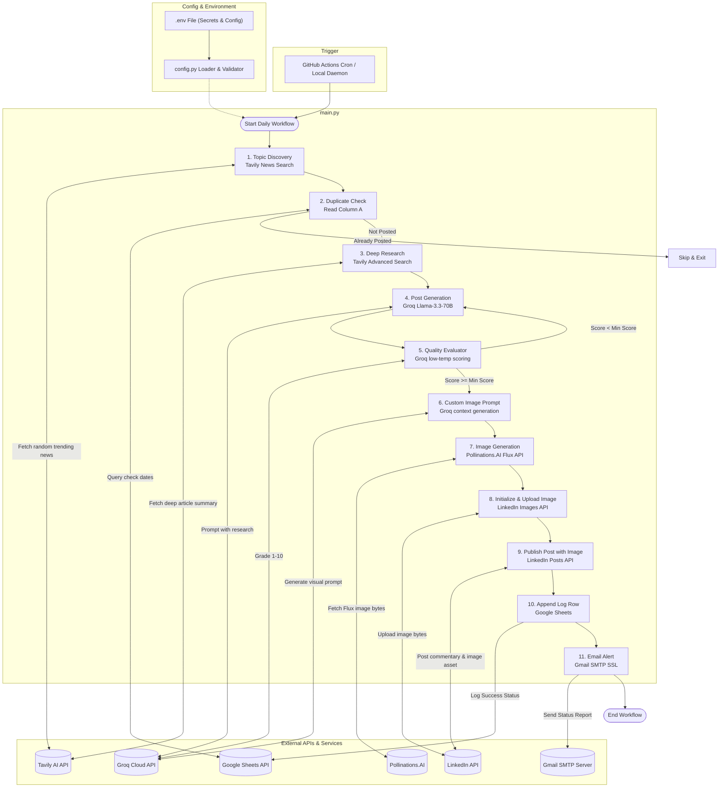

# LinkedIn AI Post Automation

    


A polished AI-powered automation system that discovers fresh tech and AI trends, writes engaging LinkedIn posts, generates matching visuals, publishes them automatically, and tracks the workflow with logs and notifications.

## Table of Contents

- [LinkedIn AI Post Automation](#linkedin-ai-post-automation)
  - [Table of Contents](#table-of-contents)
  - [Overview](#overview)
    - [What it does](#what-it-does)
  - [Why This Project Exists](#why-this-project-exists)
  - [Features](#features)
  - [Tech Stack](#tech-stack)
  - [Architecture](#architecture)
  - [Project Structure](#project-structure)
  - [Installation](#installation)
    - [1. Clone the repository](#1-clone-the-repository)
    - [2. Create a virtual environment](#2-create-a-virtual-environment)
    - [3. Install dependencies](#3-install-dependencies)
    - [4. Configure environment variables](#4-configure-environment-variables)
    - [5. Add your Google credentials](#5-add-your-google-credentials)
  - [Environment Variables](#environment-variables)
  - [Usage](#usage)
    - [Run once immediately](#run-once-immediately)
    - [Run on a schedule](#run-on-a-schedule)
    - [Generate a LinkedIn access token](#generate-a-linkedin-access-token)
  - [Screenshots \& Demo](#screenshots--demo)
  - [Roadmap](#roadmap)
  - [Contributing](#contributing)
  - [License](#license)
  - [Acknowledgments](#acknowledgments)

## Overview

This project combines modern AI APIs, automation workflows, and social media publishing into a single, practical solution for building a daily LinkedIn presence without manual effort. It is designed for developers, creators, and professionals who want to share thought leadership content consistently.

### What it does

- Finds current AI and technology topics from live web sources
- Writes a concise, high-quality LinkedIn post
- Generates a matching image prompt and visual
- Publishes the content to LinkedIn
- Logs the activity and notifies the owner by email

## Why This Project Exists

Creating consistent content on LinkedIn can be time-consuming, especially when balancing research, writing, ideation, and publishing. This project removes that friction by automating the end-to-end workflow so users can focus on strategy while the system handles execution.

It is also a strong portfolio project because it brings together:

- API integrations
- automation and scheduling
- secure environment configuration
- external service orchestration
- practical deployment readiness

## Features

- 🤖 Smart topic discovery using real-time search data
- ✍️ AI-generated LinkedIn post content with quality checks
- 🖼️ Visual asset generation for more engaging posts
- 🔁 Duplicate prevention through Google Sheets tracking
- 📧 Email alerts for success or failure cases
- ⚙️ Scheduled execution using local automation or GitHub Actions
- 🔐 Secure configuration via environment variables

## Tech Stack

- 🐍 Python 3.13+
- 🤖 Groq Cloud API for post generation and scoring
- 🔎 Tavily API for live topic discovery and research
- 🎨 Pollinations.AI for image generation
- 💼 LinkedIn API for publishing posts
- 📊 Google Sheets API for logging and duplicate detection
- ✉️ Gmail SMTP for email notifications
- 🧰 GitHub Actions for automation workflows
- 📦 python-dotenv, requests, schedule, gspread, google-auth

## Architecture



## Project Structure

```text
linkedin-automation/
├── .github/
│   └── workflows/
│       └── linkedin-post.yml
├── credentials/
├── logs/
├── config.py
├── get_linkedin_token.py
├── main.py
├── requirements.txt
├── .env.example
├── LICENSE
└── README.md
```

## Installation

### 1. Clone the repository

```bash
git clone https://github.com/your-username/linkedin-automation.git
cd linkedin-automation
```

### 2. Create a virtual environment

```bash
python -m venv .venv
source .venv/bin/activate
```

### 3. Install dependencies

```bash
pip install -r requirements.txt
```

### 4. Configure environment variables

```bash
cp .env.example .env
```

Then fill in the required values in the `.env` file.

### 5. Add your Google credentials

Place your Google Service Account JSON file inside the `credentials/` folder and point `GOOGLE_CREDENTIALS_FILE` to it.

## Environment Variables

Example configuration:

```env
GROQ_API_KEY=your_groq_key
TAVILY_API_KEY=your_tavily_key
POLLINATIONS_API_KEY=your_pollinations_key
LINKEDIN_ACCESS_TOKEN=your_linkedin_token
LINKEDIN_PERSON_URN=your_linkedin_person_urn
LINKEDIN_CLIENT_ID=your_client_id
LINKEDIN_CLIENT_SECRET=your_client_secret
GOOGLE_SHEET_ID=your_google_sheet_id
GOOGLE_CREDENTIALS_FILE=credentials/your-service-account.json
SHEET_NAME=Posts
GMAIL_SENDER=you@example.com
GMAIL_RECEIVER=you@example.com
GMAIL_APP_PASSWORD=your_app_password
POST_TIME=10:00
MAX_RETRIES=3
QUALITY_MIN_SCORE=6
```

## Usage

### Run once immediately

```bash
python main.py --now
```

### Run on a schedule

```bash
python main.py
```

### Generate a LinkedIn access token

```bash
python get_linkedin_token.py
```

> This project does not expose a public REST API. It runs as an automation script locally or via GitHub Actions.

## Screenshots & Demo


Suggested demo items:

- Workflow execution logs
- Sample generated LinkedIn post
- Example image output
- Google Sheets tracking view

## Roadmap

Planned improvements include:

- 🧠 Better post personalization based on user profile or niche
- 📈 Analytics dashboard for post performance
- 🗂️ Support for multiple social platforms
- 🧪 Automated tests and CI validation
- ☁️ Dockerized deployment for easier hosting

## Contributing

Contributions are welcome.

1. Fork the repository
2. Create a feature branch
3. Commit your changes
4. Open a pull request

Please keep the code clean, document new features clearly, and follow the existing project style.

## License

This project is licensed under the MIT License. See the [LICENSE](LICENSE) file for details.

## Acknowledgments

Special thanks to the teams and services behind:

- Groq
- Tavily
- Pollinations.AI
- Google Sheets API
- LinkedIn API
- GitHub Actions

Built with the goal of making AI-driven content automation practical, professional, and accessible.
