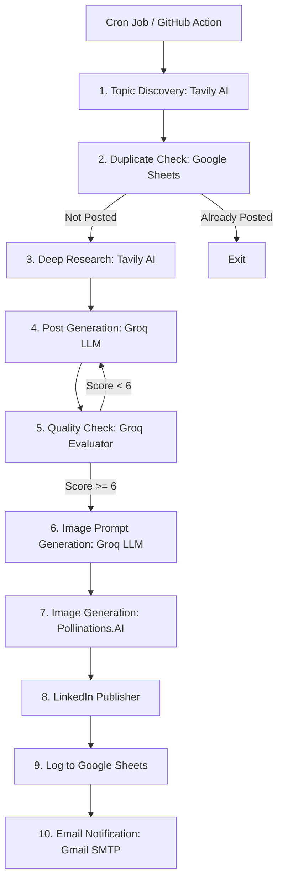

# 🚀 AI-Powered LinkedIn Post Automation

A fully automated Python system that researches trending topics daily, generates high-quality LinkedIn posts with matching AI-generated images, publishes them directly to LinkedIn, logs actions to Google Sheets, and sends email notifications upon completion.

---

## 🛠️ Architecture & Workflow



---

## ✨ Features

- **Dynamic Topic Discovery**: Uses the Tavily API to search for the absolute latest trending news in AI and technology (no repetitive pre-defined prompts).
- **In-Depth Research**: Summarizes content from multiple web sources using Tavily to provide rich context to the LLM.
- **Double LLM Guardrail**: A primary Llama model writes the post, and a secondary review prompt grades it (1–10) to filter out generic content.
- **Dynamic Image Prompt Generation**: Asks Groq to analyze the generated post and compose a custom, highly descriptive image prompt.
- **AI Art Integration**: Generates matching high-fidelity images using Pollinations.AI based on the custom prompt.
- **Self-Cleaning Tracker**: Keeps track of daily posts in a Google Sheet to prevent double-posting or duplicate topic selection.
- **Fail-Safe Alerts**: Sends a detailed email containing the post contents (or the error stack trace if a failure occurs).

---

## 📋 Prerequisites

Ensure you have the following installed:
- Python 3.13 or higher (or Anaconda)
- Active accounts/API Keys for:
  - [Groq Cloud](https://console.groq.com/)
  - [Tavily AI](https://app.tavily.com/)
  - [LinkedIn Developer Portal](https://developer.linkedin.com/) (with Share on LinkedIn API permissions)
  - Google Cloud Console (for Google Sheets Service Account)

---

## ⚙️ Installation & Setup

### 1. Clone & Install Dependencies
Clone the repository and install the required library packages:
```bash
pip install -r requirements.txt
```

### 2. Configure Environment Variables
Copy the `.env.example` file to `.env`:
```bash
cp .env.example .env
```
Fill in the values in your `.env` file (refer to the **Configuration Values** section below).

### 3. Add Google Service Account JSON
Create a directory named `credentials` and place your Google Service Account credential file inside:
```bash
mkdir credentials
# Put your JSON key file here: credentials/service-account.json
```
Make sure the path matches `GOOGLE_CREDENTIALS_FILE` in your `.env`.

---

## 🔑 Configuration Values (`.env`)

| Variable Name | Description | Example / Default |
| :--- | :--- | :--- |
| `GROQ_API_KEY` | Groq LLM API Key | `gsk_...` |
| `TAVILY_API_KEY` | Tavily Search API Key | `tvly-...` |
| `POLLINATIONS_API_KEY`| Pollinations.AI Key | `sk_...` |
| `LINKEDIN_ACCESS_TOKEN`| 60-day User Access Token | (See token generation below) |
| `LINKEDIN_PERSON_URN` | Your Person/Member URN | `urn:li:person:XXXXX` |
| `GOOGLE_SHEET_ID` | Google Sheet spreadsheet ID | `1VH...` |
| `GOOGLE_CREDENTIALS_FILE`| Relative path to Service Account JSON | `credentials/your-key.json` |
| `SHEET_NAME` | Name of the sheet/tab to log runs | `Posts` |
| `GMAIL_SENDER` | Sender email address for SMTP | `you@gmail.com` |
| `GMAIL_RECEIVER` | Receiver email address | `you@gmail.com` |
| `GMAIL_APP_PASSWORD` | Google Account App Password | `xxxx xxxx xxxx xxxx` |
| `POST_TIME` | Scheduled posting time (24h) | `10:00` |

---

## 🔑 Generate LinkedIn Access Token

Since LinkedIn access tokens expire every 60 days, you must generate your token locally before deploying:
1. Obtain a Client ID and Client Secret from your LinkedIn Developer App.
2. Add them to your local `.env` (`LINKEDIN_CLIENT_ID` and `LINKEDIN_CLIENT_SECRET`).
3. Run the OAuth token retrieval script:
   ```bash
   python get_linkedin_token.py
   ```
4. Follow the prompt to log in via browser and copy the resulting `LINKEDIN_ACCESS_TOKEN` and `LINKEDIN_PERSON_URN` into your `.env` (and into GitHub Secrets).

---

## 🏃 Run the Automation

### Run Immediately (One-off / Testing)
To bypass the scheduling loop and post immediately, run:
```bash
python main.py --now
```
*(Or set the environment variable `RUN_NOW=true` before running)*

### Run as a Local Background Daemon
To run the built-in schedule runner locally (uses the `POST_TIME` value):
```bash
python main.py
```

---

## 🤖 GitHub Actions Automation

This project is ready to run automatically as a serverless cron job using GitHub Actions.

### Setup Instructions
1. Push the repository to GitHub.
2. In your GitHub repository, navigate to **Settings** -> **Secrets and variables** -> **Actions** -> **New repository secret**.
3. Add all the key variables listed in the `.env` (make sure to paste the raw text content of your service account JSON into a secret named `GOOGLE_CREDENTIALS_JSON`).
4. The action is configured in [.github/workflows/linkedin-post.yml](.github/workflows/linkedin-post.yml) to run daily at **4:30 AM UTC (10:00 AM IST)** and can also be triggered manually using the **Run workflow** button under the Actions tab.

---

## 📁 File Structure

```text
├── .github/workflows/
│   └── linkedin-post.yml      # GitHub Actions automation configuration
├── credentials/               # Folder for Google Cloud keys (gitignored)
├── logs/                      # Executions logs (gitignored)
├── .env.example               # Template environment configuration
├── config.py                  # Environment-agnostic config parser
├── get_linkedin_token.py      # OAuth2 helper script to generate/refresh token
├── main.py                    # Core application entrypoint and scheduler
├── requirements.txt           # Package dependencies
└── README.md                  # Project documentation
```

---

## 📜 License
This project is open-source and free to use.
